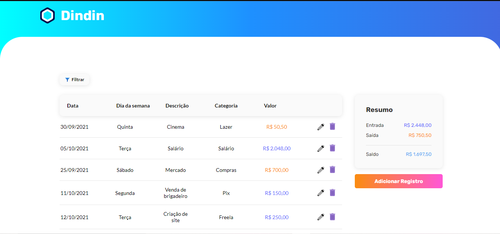

# Projeto 3 - Dindin

Dindin é uma aplicação de controle de finanças que foi desenvolvida durante o bootcamp da Cubos Academy como projeto final do terceiro módulo. Ela permite que o usuário cadastre seus ganhos e despesas, fornecendo algumas informações sobre a transação, como valor, categoria, data e descrição. Além disso, permite editar e excluir uma transação. Para construir esse projeto, foi utilizado react para o frontend e nodejs para o backend. O banco de dados foi simulado por meio de um arquivo json e pelo uso do insomnia.

